# CONTEXT_INDEX

Reconnaissance index for Lampac NextGen. Facts are from the tree, `Directory.Packages.props`, `NextGen.slnx`, `config/base.conf`, `Core/Program.cs`, `Core/Startup.cs`, `AGENTS.md`, and the files cited below. This file is not a product source of truth. Behavior still lives in code, `config/base.conf`, and each module `manifest.json`.

---

## 1. Executive Summary

Lampac NextGen is a self-hosted ASP.NET Core media aggregator. One process on port **9118** (dev compose **29118**) serves the Lampa web client, VOD and adult plugins, stream proxying, torrent indexing, music, bookmarks, and admin tools.

The host is `Core/` (`net10.0`). Almost every feature is a separately compiled module that references `Shared/` and is loaded at startup from `module/` and `mods/` (Roslyn compile from source when a folder has `manifest.json`). Client playback does not call upstream CDNs directly in the common path: a provider returns an encrypted `ProxyLink`, and the player fetches `/proxy/{token}` (or `/proxy-dash/`).

There is no Cloudflare Workers project, no root Node app, and no OpenAPI spec. The only Node project is the Astro marketing site in `site/`. Operator docs are Mintlify MDX in `docs/`.

Config layers, in order:

1. `Shared/CoreInit.cs` — value when the key is absent
2. `config/base.conf` — shipped override (wins over CoreInit)
3. Operator `init.conf` / `init.yaml` in the process working directory
4. Module `manifest.json` `enable` — whether that module is compiled and loaded

`config/example.init.conf` and `config/example.init.yaml` are templates only.

---

## 2. Architecture & Directory Map

### Runtime

| Item | Value |
| --- | --- |
| Framework | `net10.0` (`Microsoft.NET.Sdk.Web` for Core) |
| Solution | `NextGen.slnx` — **123** projects |
| Package versions | `Directory.Packages.props` (`ManagePackageVersionsCentrally=true`) |
| Host project | `Core/Core.csproj` → `Shared/Shared.csproj` only |
| Online / SISI | Libraries; ProjectReference to Shared; no direct NuGet |
| Tests | No test csproj in the solution. `dotnet test` is not a gate. `Online/tests/` is `.cjs`. A stray `JacRed.Tests.csproj` under `.vscode/temp/` is not in the solution. |

### Directory roles

| Path | Role |
| --- | --- |
| `Core/` | Host: `Program.cs`, `Startup.cs`, `Middlewares/`, `Controllers/`, `wwwroot/` |
| `Shared/` | Library every module uses: `CoreInit`, HTTP, hybrid cache, `ProxyLink`, base controllers, `PlaywrightCore/` |
| `Online/` | VOD core: `GET /online.js`, `/lite` aggregation, `OnlineApi.cs`, `ModInit.cs`, `plugin.js` |
| `SISI/` | 18+ core: `/sisi.js`, bookmarks/history |
| `Modules/` | One csproj (or a family of csprojs) per feature or provider |
| `config/` | `base.conf` + example init templates |
| `site/` | Astro 7 marketing site (`src/`, `public/`). Not the Lampa player. |
| `docs/` | Mintlify operator docs (`docs.json`, MDX). Russian. |
| `charts/lampac/` | Helm chart |
| `ansible/` | `site.yml`, `roles/lampac` |
| `examples/` | Sample modules (`PingPong`, `Cron`, …) and `NextHUB/base.yaml`. Not in `NextGen.slnx`. |
| `lampac-docker/` | Compose bind-mount tree (`config/`, `plugins/`, `img/`) |
| `lampac-ng/` | Local audit notes only. Not product code. |

### Module families (in solution)

| Family | Path | Notes |
| --- | --- | --- |
| Admin | `Modules/AdminPanel`, `DatabaseEditor`, `WebLog`, `Telemetry`, `LogUserRequest-Lite` | `[Authorization]` + Accsdb |
| Playback | `Modules/Proxy/{Corseu,CorsMedia,CubProxy,TmdbProxy,ProxyLimiter,CacheMedia}`, `Transcoding`, `GStreamer`, `TorrServer`, `DLNA`, `Tracks` | Not `Core/Middlewares/ProxyAPI*.cs` |
| VOD | `Modules/OnlineRUS`, `OnlinePaid`, `OnlineENG`, `OnlineUKR`, `OnlineGEO`, `OnlineAnime` | One provider = one csproj |
| Adult | `Modules/Adult/*`, `SISI/`, `Modules/NextHUB` | YAML catalogs in NextHUB |
| Clients | `Modules/LampaWeb`, `ForkPlayerXML`, `MsxNative`, `LampacApk`, `Catalog`, `Kit`, `ExternalBind`, `PidTor`, `Potok` | Lampa widgets, `/fxml` |
| Sync | `Modules/Sync/{Sync,SyncEvents,Storage,TimeCode}`, `WatchTogether`, `SeriesNotify` | `/bookmark`, `/timecode` |
| Community | `Modules/Community/{OidcAuth,QRAuth,TelegramAuth,TelegramAuthBot}`, `Tg-notify.bot` | |
| Other | `JacRed`, `Music` | `/api/v2.0` indexers; `/music` |

**Empty on disk, not the real code:** top-level `Modules/CubProxy`, `Modules/TmdbProxy`, `Modules/TimeCode`. Real projects are `Modules/Proxy/CubProxy`, `Modules/Proxy/TmdbProxy`, `Modules/Sync/TimeCode`. `Modules/OnlinePacks/*` are empty stubs and are not in `NextGen.slnx`.

### NuGet (central versions)

| Package | Version |
| --- | --- |
| BencodeNET | 5.0.0 |
| GirCore.GLib-2.0 / GObject-2.0 / Gst-1.0 / GstApp-1.0 / GstBase-1.0 | 0.8.1 |
| HtmlAgilityPack | 1.13.0 |
| HtmlKit | 1.3.0 |
| Jint | 4.16.4 |
| MaxMind.GeoIP2 | 6.1.0 |
| Microsoft.CodeAnalysis.CSharp / .Scripting | 5.9.0 |
| Microsoft.EntityFrameworkCore / .Design / .Sqlite | 10.0.12 |
| Microsoft.Extensions.DependencyModel | 10.0.12 |
| Microsoft.IO.RecyclableMemoryStream | 3.0.1 |
| Microsoft.Playwright | 1.63.0 |
| MonoTorrent | 3.0.2 |
| NetVips / NetVips.Native | 3.2.0 / 8.18.7 |
| Newtonsoft.Json | 13.0.4 |
| Serilog.AspNetCore / Sinks.File | 10.0.0 / 7.0.0 |
| SQLitePCLRaw.bundle_e_sqlite3 | 2.1.13 |
| System.Management | 10.0.12 |
| Telegram.Bot | 22.10.3.2 |
| YamlDotNet | 18.1.0 |
| YoutubeExplode | 6.6.2 |

Shared is the project that references these. Core does not add its own PackageReferences.

### site/ npm

`site/package.json` — Node `>=22`. Dependencies: `astro` ^7.3.5, `@astrojs/sitemap` ^3.7.4. Dev: `@astrojs/check` ^0.9.10, `typescript` ^6.0.3.

**Absent at repo root:** `package.json`, `wrangler.toml`, `.env.example`, `eslint.config.js`, `.claude/`, `knowledge/`, `fixtures/`, OpenAPI/Swagger files.

### Commands

| Goal | Command |
| --- | --- |
| Build one project | `dotnet build path/to/Project.csproj --nologo` |
| Publish host | `dotnet publish Core/Core.csproj` or `./build.sh` (optional `--clean`, `--format`) → `publish/` |
| Makefile | `make` / `make build`, `publish`, `restore`, `format`, `format-check`, `check` (`test` aliases `check`), `clean`, `up`/`down`/`logs`/`ps`, `dev-setup`/`dev-up`/`dev-down`, `docker-build`(+amd64/arm64/all), `docker-push`, `docker-export`, `helm-lint`/`helm-template`/`helm-dry-run` |
| Compose | `docker-compose.yaml` maps **9118:9118**; `docker-compose.dev.yaml` maps **29118:29118** |
| Image | `Dockerfile`: `builder` (debian:13-slim, `dotnet publish` + ffmpeg) → `runner` (GStreamer/Chrome, user `lampac:1000`, `EXPOSE 9118`, `dotnet Core.dll`) |
| Native install | `install.sh` — Debian/Ubuntu from a GitHub release zip, ASP.NET Core 10, systemd, default `/opt/lampac`, port 9118 |
| Astro site | In `site/`: `npm run dev`, `npm run build` (`astro check && astro build`), `npm run preview` |
| Docs | From `docs/`, when Mintlify CLI is installed: `mint validate`, `mint broken-links --check-anchors`, `mint a11y` |
| CI | `.github/workflows/pages.yml` builds `site/` and publishes `site/dist`. `.github/workflows/release.yml` tags from a manual input. Neither is a local test gate. |

---

## 3. Agent & Skill Ecosystem

`.agents/` is the portable source of truth: role cards in `.agents/agents/`, theses in `.agents/references/theses.md`, metadata check `node .agents/scripts/validate-agents.mjs`. Cursor entrypoints are thin `.cursor/agents/*.md` files that point at those cards. `CLAUDE.md` is a stub that points at `AGENTS.md` and does not copy the role table. Product architecture pointer: `ARCHITECTURE.md`.

**Intentionally absent:** `.claude/`, `.github/agents`, `.github/prompts`, `.github/instructions`, `.github/skills`, `.cursor/skills`, `.cursor/commands`, `wrangler.toml`.

Skills are `.agents/skills/` (14 Lampac, `ponytail`, and Mintlify). `lampac-repo` is a skill every Lampac agent reads. It is not an agent. `ponytail` applies to every code change. No skill ships a `.py` / `.sh` / `.cjs` helper. The validator script is not a skill helper. The only skill siblings are `.agents/skills/lampac-online/reference.md` and `.agents/skills/lampac-media/reference.md`.

Agent filenames match the interaction matrix in `AGENTS.md` exactly. Skill directories match the Skills table exactly (18).

| Agent | Working directories | Skill |
| --- | --- | --- |
| `lampac-core` | `Core/` (including `Core/Middlewares/ProxyAPI*.cs`) | `lampac-core` + `lampac-repo` |
| `lampac-shared` | `Shared/` | `lampac-shared` |
| `lampac-modules` | New `Modules/<Name>/`, `NextGen.slnx` | `lampac-modules` |
| `lampac-online` | `Online/`, `Modules/Online{RUS,Paid,ENG,UKR,GEO,Anime,Packs}` | `lampac-online` |
| `lampac-sisi` | `SISI/`, `Modules/Adult`, `Modules/NextHUB` | `lampac-sisi` |
| `lampac-media` | `Modules/Proxy`, Transcoding, GStreamer, TorrServer, DLNA, Tracks | `lampac-media` |
| `lampac-jacred` | `Modules/JacRed` | `lampac-jacred` |
| `lampac-music` | `Modules/Music` | `lampac-music` |
| `lampac-sync` | `Modules/Sync`, WatchTogether, SeriesNotify, TimeCode | `lampac-sync` |
| `lampac-community` | `Modules/Community`, `Modules/Tg-notify.bot` | `lampac-community` |
| `lampac-admin` | AdminPanel, DatabaseEditor, WebLog, Telemetry, LogUserRequest-Lite | `lampac-admin` |
| `lampac-clients` | LampaWeb, ForkPlayerXML, MsxNative, LampacApk, Catalog, Kit, ExternalBind, PidTor, Potok | `lampac-clients` |
| `lampac-deploy` | install, Docker, charts, ansible, `config/`, release and Pages workflows | `lampac-deploy` |
| `mintlify-docsops` | `docs/` | `.agents/skills/mintlify` (+ `mintlify-api` for API pages) |

Rules: `.cursor/rules/mintlify-docs.mdc` applies only to `docs/**/*.mdx`, `docs/docs.json`, `docs/AGENTS.md`, and `.devin/wiki.json`.

MCP (`.cursor/mcp.json`): `Mintlify` → `https://mintlify.com/docs/mcp`, `Mintlify MCP` → `https://mcp.mintlify.com`.

`.devin/wiki.json` steers a public English code wiki. It is not the operator docs. Do not copy Mintlify MDX into it (`docs/AGENTS.md`).

GitHub automation (not agents): `.github/workflows/` (`build.yml`, `test-build.yml`, `format-code.yml`, `pages.yml`, `release.yml`, reusable build/docker/version/upload workflows, labeler, stale, sync-labels) plus `CODEOWNERS`, `dependabot.yml`, issue/PR templates.

Relative markdown links in `AGENTS.md`, `CLAUDE.md`, and `docs/AGENTS.md` resolve.

---

## 4. Data Flows & Lifecycle

### Process start

`Core/Program.Main` (`Core/Program.cs`):

- Resolves extra assemblies from `runtimes/references` (publish layout).
- Builds Roslyn `CSharpEval.appReferences` from `TRUSTED_PLATFORM_ASSEMBLIES` (`Program.cs` ~71).
- Creates or reads CWD file `passwd` into `CoreInit.rootPasswd` (`Program.cs` ~147–156).
- Optionally starts Playwright Chromium/Firefox and their cron (`Program.cs` ~159–178).
- Starts `_usersTimer` every 1s for `UpdateUsersDb` (`Program.cs` ~234).

`Core/Startup` compiles and loads modules:

- Prebuilt `*.dll` under the module folder are `Assembly.LoadFile` + `AddApplicationPart` (`Startup.cs` ~312–326).
- Source folders with `manifest.json` are compiled when `BaseModule.LoadModules` matches (shipped `base.conf` uses `".*"`) and the folder is not in `SkipModules` (`Startup.cs` ~335–376, `config/base.conf` ~21–41).
- After configure, `current.conf` is written as the merged config snapshot (`Startup.cs` ~534).
- Shutdown disposes Chromium, Firefox, native WebSocket, and modules (`Startup.cs` ~755–768) unless `Program._reload` is set.

### Middleware order

From `Core/Startup.cs` ~538–751, when the matching flags are on:

1. Exception handler (JSON `{"error":"Internal server error"}`; log target from config; shipped `base.conf` sets `exceptionHandlerLogTarget` to `none`)
2. Developer exception page (only if enabled)
3. Forwarded headers (`X-Forwarded-For`, `X-Forwarded-Proto`)
4. Cookie policy → `BaseMod` → `ModHeaders` → `RequestInfo`
5. Optional `/nws` WebSocket branch (own WAF)
6. Routing → response compression → `Staticache`
7. Optional anonymous-request middleware
8. Module middleware **first** (`EventListener.Middleware` / `MiddlewareAsync`)
9. Optional override-response (first)
10. **Branch** `MapWhen` `/proxy/` and `/proxy-dash/` → `ProxyAPI` (`Startup.cs` ~666–672). This branch is **before** Accsdb. `/proxyimg` → `ProxyImg` when enabled.
11. Static files (bookmarks gated when accsdb is on)
12. WAF — only if `init.WAF.enable` (shipped `base.conf` sets this **false**)
13. Authorization → **Accsdb** (when enabled, paths starting with `/proxy` return early at `Accsdb.cs` ~104–105)
14. Module middleware **second**
15. Override-response (not first) → rate limiter → openstat → `StaticacheWriter`
16. Endpoints: `MapControllers()` + `MapRchApi()`

`/proxy` is owned by `Core/Middlewares/ProxyAPI.cs` (+ `.M3u8.cs`, `.Dash.cs`, `.Utilities.cs`). It decrypts `ProxyLink` and fetches upstream with `FriendlyHttp`. `Modules/Proxy/*` are separate feature modules (Cub, TMDB, Corseu, CorsMedia, ProxyLimiter, CacheMedia). CacheMedia only hooks `EventListener.ProxyApiCacheStream`. Do not treat them as the stream middleware.

### Base abstractions

| Type | Path | Role |
| --- | --- | --- |
| `BaseController` | `Shared/Controllers/BaseController.cs` | Request helpers, `HostStreamProxy` → `ProxyLink.Encrypt` (~506, ~521) |
| `BaseOnlineController<T>` | `Shared/Controllers/BaseOnlineController.cs` | VOD providers; optional `RchClient` |
| `BaseENGController` | `Shared/Controllers/BaseENGController.cs` | English-embed family |
| `BaseSisiController` | `Shared/Controllers/BaseSisiController.cs` | Adult providers |
| `ProxyLink` | `Shared/Services/ProxyLink.cs` | AES (stateless) or MD5 key into static `links`; cron every 1 minute (`~26`, `~639`) |
| `SafeHttpUrl` | `Shared/Services/Utilities/SafeHttpUrl.cs` | SSRF check on literal hostnames only |
| `IModuleLoaded` / `IModuleConfigure` | per module `ModInit` | `Loaded()` after the pipeline; `Configure()` during DI (Online registers `ExternalidsContext`) |
| `IModuleOnline` | provider `ModInit` | Returns `List<ModuleOnlineItem>` — the balancer buttons |
| `OnlineModuleEntry` | `Shared/Models/Module/Entrys/OnlineModuleEntry.cs` | Scans loaded assemblies for `IModuleOnline` / async / spider |
| `EventListener` | `Shared/Models/Events` | Multicast hooks (`HostStreamProxy`, `UpdateInitFile`, `Accsdb`, middleware) |
| Hybrid cache / `FileCache` / `IMemoryCache` | `Shared/Services/Hybrid`, controllers | Response and file caching (`online.js` caches plugin text 10 minutes) |

### End-to-end: Lampa → stream

```mermaid
flowchart LR
  Lampa[Lampa_client] --> OnlineJs["GET /online.js"]
  OnlineJs --> Events["GET /lite/events"]
  Events --> Buttons["IModuleOnline.Invoke"]
  Buttons --> Lite["GET /lite/plugin"]
  Lite --> Host[HostStreamProxy]
  Host --> Encrypt[ProxyLink.Encrypt]
  Encrypt --> Player[Player]
  Player --> Proxy["GET /proxy/token"]
  Proxy --> Up[Upstream_CDN]
```

1. Lampa loads `GET /online.js` or `/online/js/{token}` (`Online/OnlineApi.cs` ~37–39). Anonymous, `Staticache` 20s. Body is rewritten `plugin.js`. `Online/ModInit.cs` does **not** register buttons. It loads the `online` config, hooks `UpdateInitFile`, inserts WAF limits for `/lite/` and `/lifeevents`, and calls `ModuleCapabilities.Set("online")`.
2. Opening a card calls `GET /lite/events` (`OnlineApi.cs` ~651–653). That action walks `OnlineModuleEntry` and each provider `IModuleOnline.Invoke` (for example `Modules/OnlineRUS/CDNvideohub/ModInit.cs`). `send()` builds `{localhost}/lite/{plugin}` (`OnlineApi.cs` ~486, async fan-out ~836). Check-search results come back through `/lifeevents`.
3. `GET /lite/{plugin}` hits that provider's `BaseOnlineController`: `InvokeCacheResult` / `httpHydra` for the playlist, then `HostStreamProxy` → `ProxyLink.Encrypt` with prefix `/proxy/` (`BaseController.cs` ~521–585). If stream-proxy is off, the raw upstream URL is returned.
4. The player requests `/proxy/{hash}` (HLS) or `/proxy-dash/` (DASH). `ProxyAPI` decrypts the token and proxies bytes, rewriting playlist URLs back through `/proxy/` (`ProxyAPI.cs` ~48–52, ~240).
5. Accsdb can gate `/lite` when `accsdb.enable` is true. It does **not** gate `/proxy`: the middleware branch runs first, and Accsdb returns early for `/proxy*` (`Accsdb.cs` ~104–105). Stream checks are ProxyLink expiry and IP, not the admin cookie. Admin routes still check `[Authorization]` and path prefixes `/admin`, `/weblog`, `/stats` against cookie `accspasswd` and `CoreInit.rootPasswd`. Shipped `base.conf` has `accsdb.enable: false`.

`site/` (Astro) is a public site, not this player. The player UI is `Modules/LampaWeb` (`ModInit` hooks `UpdateInitFile` and `Accsdb`, starts `LampaCron`). Shipped `LampaWeb.initPlugins` turns on online, sisi, jacred, tmdbProxy, cubProxy, torrserver, timecode (`config/base.conf` ~8–19).

### Lifetime notes (not a leak audit)

| Spot | Why it matters |
| --- | --- |
| `Program._usersTimer` | Static timer, 1s, process lifetime (`Program.cs` ~37, ~234) |
| `ProxyLink.links` + `Cron` | MD5 links live in a static dictionary (`ProxyLink.cs` ~24). Cron removes a row only when `ex != default` and `now > ex` (~653). Rows stored with `ex == default` stay for the process lifetime. |
| `EventListener.*` multicast | Modules must unsubscribe in `Dispose`. `LampaWeb/ModInit.cs` and `Online/ModInit.cs` do. `Modules/Proxy/CacheMedia/ModInit.cs` adds `ProxyApiCacheStream` with a lambda (~12) and `Dispose()` is empty (~39–41), so a module rebuild stacks handlers. |
| Playwright | Chromium/Firefox processes; `FullDispose` on shutdown (`Startup.cs` ~764–765). `Chromium.CronStart` while browsers are enabled. |
| Accsdb IP cache | `ConcurrentDictionary` per IP, expires next calendar day, caps distinct password guesses (`Accsdb.cs` ~62–68) |
| `online.js` memory cache | 10-minute `IMemoryCache` entry holding plugin source (`OnlineApi.cs` ~45–47) |
| Startup GC | Aggressive collect once after module load (`Startup.cs` ~529–532) — startup cost, not a leak |

---

## 5. Integration Contracts

There is no `knowledge/`, `fixtures/`, or OpenAPI document. `docs/AGENTS.md` says API pages stay hand-written MDX and OpenAPI is not added unless asked. Runtime contracts are C# models (`ModuleConf`, provider `Model.cs`) plus `init.conf` sections.

**MDBList is not referenced in this repository.**

| Integration | Config key | Code |
| --- | --- | --- |
| Cub | `CoreInit` `cub` (`api_key`, `domain`/`mirror`; module init key `cub`) | `Modules/Proxy/CubProxy/`; ForkPlayer `CubController` talks to Cub's TMDB mirror |
| TMDB | Same Cub key; module key `tmdb`; Lampa plugin `tmdbProxy` | `Modules/Proxy/TmdbProxy/` → `api.themoviedb.org`, `image.tmdb.org` |
| Alloha | `init.conf` section `Alloha` (`token`, `secret_token`, hosts) | `Modules/OnlinePaid/Alloha/` (`ModInit` default hosts, Bearer `/movies/*`). JacRed also calls `api.alloha.tv` |
| Kinopoisk | Not a global CoreInit section. `kinopoisk_id` on `/lite/*`. Optional `SeriesNotify.kp_api_key` | `Modules/SeriesNotify` → `kinopoiskapiunofficial.tech` |
| JacRed | Jackett-style tracker conf | `Modules/JacRed`, routes under `/api/v2.0` |
| OIDC / Telegram | Operator IdP + bot token in init | `Modules/Community/*`, `api.telegram.org` |
| Music | Provider creds in init | Spotify, Apple Music, SoundCloud, Yandex via `Modules/Music` |
| OMDb | `omdbapi_key` | Poster images when set |
| Online / SISI sites | Per-module `apihost` in init | One controller per csproj; families documented in `.agents/skills/lampac-online/reference.md` |

Outbound calls also include tracker hosts (JacRed) and local loopback (`127.0.0.1` with header `lcrqpasswd`) from Catalog, DLNA, and Transcoding into `/tmdb` and `/ffprobe`.

### Secrets

| Secret | Where |
| --- | --- |
| Admin password | CWD file `passwd` → `CoreInit.rootPasswd`. Cookie `accspasswd`. Not an environment file. |
| Provider tokens | Operator `init.conf` / `init.yaml`, not `base.conf` |
| Internal calls | Header `lcrqpasswd` |

Do not copy live tokens, the contents of `passwd`, or private hosts into docs or this index.

### Request checks

| Check | Where | Shipped default |
| --- | --- | --- |
| Path/query scrub, identity, bot block | `Core/Middlewares/BaseMod.cs` when `BaseModule.ValidateRequest` / `ValidateIdentity` / `BlockedBots` | **false** in `config/base.conf` ~22–24 (CoreInit defaults are true; base.conf wins) |
| WAF rate maps | `Core/Middlewares/WAF.cs` | **`WAF.enable: false`** in `config/base.conf` ~59–61 |
| SSRF | `SafeHttpUrl.IsSafe` on ProxyAPI redirects, ProxyImg, NextHUB, GStreamer, `Http.DownloadFile` | Hostname literals and private IPs only. **No DNS resolve** (`SafeHttpUrl.cs` ~7–8). Not applied to every `Http.Get`. |
| CORS | `Core/Middlewares/ModHeaders.cs` | Reflects `Origin`/`Referer`, else `*`; credentials allowed |
| Admin auth | Accsdb + `[Authorization]` | `accsdb.enable: false` shipped. When a route is authorized, cookie must match `rootPasswd`. Failed guesses: up to 10 distinct values per IP per day, then 404 (`Accsdb.cs` ~68–71). Deny JSON includes the `user` object (`Accsdb.cs` ~186–192). |

`SECURITY.md` is process-only: latest tag and `main`; report via GitHub private advisories. No threat model in that file.

---

## 6. Known Technical Debt & Pitfalls

### Security (from code, not an exploit write-up)

| Sev | Finding |
| --- | --- |
| High | `/proxy`, `/tmdb/*`, `/cub/*` can be reached as open reverse proxies. `SafeHttpUrl` rejects private **literal** IPs only, so a public hostname that resolves to a private address is not blocked (`SafeHttpUrl.cs` ~7–8). Shipped config also turns WAF off (`config/base.conf` ~59–61). |
| High | Shipped `base.conf` sets `ValidateRequest`, `ValidateIdentity`, and `BlockedBots` to false (~22–24), which turns off the BaseMod path/query and bot checks. |
| Medium | Accsdb denial body returns the full `user` object (`Accsdb.cs` ~186–192). |
| Medium | CORS reflects the caller origin and allows credentials (`ModHeaders.cs`). |
| Medium | Third-party tokens are hardcoded in source (JacRed Alloha call; default `cub.api_key` in CoreInit; a TMDB key in Zetflix). Treat those as leaked. |
| Medium | Admin auth is one shared `passwd` plus a small per-IP guess cap. Weak if the admin port is on the internet. `/proxy` is outside that gate (`Accsdb.cs` ~104–105). |
| Medium | `ProxyLink` cron never drops MD5 rows whose `ex` is `default` (`ProxyLink.cs` ~653). `CacheMedia/ModInit.cs` subscribes to `ProxyApiCacheStream` and does not unsubscribe. |
| Low | No schema/OpenAPI layer. `init.conf` JSON is deserialized per module. |
| Low | `SECURITY.md` does not describe proxy or SSRF behavior. |

### Layout traps

- Top-level `Modules/CubProxy`, `Modules/TmdbProxy`, and `Modules/TimeCode` are empty. Edit `Modules/Proxy/CubProxy`, `Modules/Proxy/TmdbProxy`, and `Modules/Sync/TimeCode`.
- `Modules/OnlinePacks/*` are empty and not in `NextGen.slnx`. The agent map still assigns that folder to `lampac-online`.
- `lampac-ng/` is not product code.
- `.vscode/temp/.../JacRed.Tests.csproj` is not a solution test project.

### Agent meta

- `.agents/skills/mintlify-docs/SKILL.md` is byte-identical to `.agents/skills/mintlify/SKILL.md` (same `name: mintlify`, same hash in `skills-lock.json`). `AGENTS.md` says read `mintlify` only and leave the duplicate for the lockfile. `.cursor/rules/mintlify-docs.mdc` matches that.
- Three names for docs work: agent `mintlify-docsops`, skill `mintlify`, lock alias `mintlify-docs`.
- `lampac-media` does not own `Core/Middlewares/ProxyAPI*.cs`. That middleware is `lampac-core`.

### Product ceilings already marked in code

- `SafeHttpUrl`: hostname literals only. Upgrade path in the `ponytail:` comment is to resolve A/AAAA and reject private answers (`SafeHttpUrl.cs` ~7).
- `config/base.conf` enables `lowMemoryMode` and small proxy buffers, with a comment to remove those settings above ~10 users (~62–70).

### What this index does not cover

Per-provider field schemas, every tracker host, and a line-by-line review of each Adult or Online controller. Use the family skill `reference.md` and the provider `Controller.cs` / `ModuleConf` for that.
