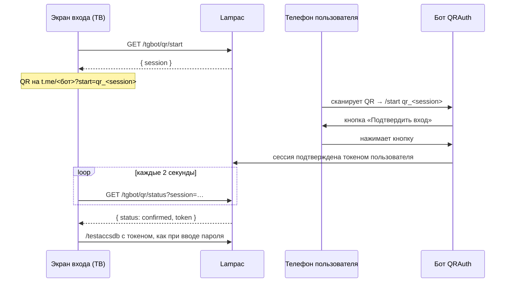

**QRAuth** — модуль Lampac NextGen из папки `Modules/Community/QRAuth`. Он заменяет стандартный экран входа на страницу с QR-кодом и подключает собственного Telegram-бота. Пользователь сканирует QR телефоном, подтверждает вход в боте, и телевизор входит сам: без пароля и экранной клавиатуры.

<Frame caption="Экран входа на ТВ и в браузере: кнопки входа слева, QR-код справа, на фоне стена постеров">
  
</Frame>

Модуль работает поверх `accsdb`. Он не заменяет авторизацию Lampac, а дописывает пользователей в общий `users.json`. Для ядра такие записи ничем не отличаются от добавленных вручную.

## Возможности

<Columns cols={2}>
  <Card title="Вход по QR" icon="qr-code">
    Наведите камеру на экран ТВ, нажмите **Подтвердить вход** в боте, и телевизор войдёт сам.
  </Card>
  <Card title="Заявки на доступ" icon="user-plus">
    Новый пользователь нажимает **Запросить доступ**, админ одобряет одной кнопкой. Если заявку подали после сканирования QR, экран входит сразу.
  </Card>
  <Card title="Управление из Telegram" icon="users">
    `/users`: список пользователей, бан и разбан. Отдельная кнопка статистики. Уведомления админам о каждом входе.
  </Card>
  <Card title="Фон из постеров" icon="clapperboard">
    Сервер собирает стену из постеров TMDB в одну готовую картинку. Слабому ТВ почти нечего считать.
  </Card>
</Columns>

## Быстрый старт

<Steps>
  <Step title="Включите модуль в manifest.json">
    В файле `Modules/Community/QRAuth/manifest.json` установите `"enable": true`. По умолчанию в репозитории стоит `false`. Уберите `QRAuth` из `BaseModule.SkipModules` (в `base.conf` модуль в SkipModules по умолчанию).
  </Step>
  <Step title="Включите accsdb">
    Задайте `accsdb.enable: true` и длинный `shared_passwd`. Модуль работает только поверх `accsdb`.
  </Step>
  <Step title="Создайте бота">
    Получите токен у [@BotFather](https://t.me/BotFather) командой `/newbot`. Свой Telegram ID для `admin_ids` покажет [@userinfobot](https://t.me/userinfobot).
  </Step>
  <Step title="Добавьте секции QRAuthBot и DenyPage">
    Скопируйте пример из раздела [Конфигурация](#конфигурация) в `init.conf`. Полный набор полей лежит в `Modules/Community/QRAuth/init.merge.example.json`.
  </Step>
  <Step title="Перезапустите Lampac">
    Выполните `systemctl restart lampac` (Linux) или перезапустите контейнер (Docker).
  </Step>
</Steps>

Собирать модуль не нужно. Lampac компилирует `.cs` при запуске, а `Telegram.Bot.dll` уже лежит в `references/`.

<Note>
  После включения модуля, а также после добавления или удаления `.cs`-файлов нужен полный перезапуск. Правки секции `DenyPage` подхватываются на лету: модуль перегенерирует `plugins/override/deny.js`.
</Note>

<Tip>
  Добавлять `tgbot/qr` в `accsdb.whitepattern` не нужно. Модуль сам пропускает свои адреса `/tgbot/qr/*` для неавторизованных посетителей через `EventListener.Accsdb`.
</Tip>

## Конфигурация

```json init.conf
{
  "accsdb": {
    "enable": true,
    "shared_passwd": "длинный_случайный_пароль",
    "accounts": {},
    "users": []
  },
  "QRAuthBot": {
    "enable": true,
    "bot_token": "ТОКЕН_ОТ_BOTFATHER",
    "admin_ids": [123456789],
    "users_file_path": "users.json",
    "log_path": "tgbot.log"
  },
  "DenyPage": {
    "tg_target": "@YourQRAuthBot",
    "show_qr": true,
    "page_title": "Вход в Lampa",
    "page_subtitle": "Войдите через Telegram или по паролю.",
    "poster_wall": true,
    "poster_source": "trending"
  }
}
```

<Tabs>
  <Tab title="QRAuthBot — бот">
    | Поле | Тип | По умолчанию | Назначение |
    | --- | --- | --- | --- |
    | `enable` | `bool` | `true` | Включает бота. При `false` экран входа работает без QR. |
    | `bot_token` | `string` | `""` | Токен от BotFather. Если пусто при `enable: true`, в консоль пишется предупреждение и бот не стартует. Сервер при этом не падает. |
    | `admin_ids` | `long[]` | `[]` | Telegram ID админов. Они получают заявки и уведомления о входах, видят `/users`. Если список пуст, бот отвечает на заявки «Администратор не настроен». |
    | `users_file_path` | `string` | `"users.json"` | Файл пользователей. Должен совпадать с файлом, который читает `accsdb`. |
    | `log_path` | `string` | `"tgbot.log"` | Собственный лог модуля: выдачи, отказы, ошибки, состояние фона. |

    <Warning>
      Поле называется `admin_ids` и принимает массив. Вариант `"admin_id": 123` модуль молча игнорирует, и админов не будет.
    </Warning>
  </Tab>
  <Tab title="DenyPage — экран входа">
    | Поле | Тип | По умолчанию | Назначение |
    | --- | --- | --- | --- |
    | `tg_target` | `string` | `""` | Бот для QR и кнопки Telegram: `@username`, `https://t.me/…` или `tg://`. Должен указывать на бот из `QRAuthBot`. |
    | `show_qr` | `bool` | `true` | QR показывается, только если задан `tg_target` и `show_qr: true`. |
    | `page_title`, `page_subtitle` | `string` | `""` | Заголовок и подзаголовок. Пустое значение заменяется текстом по умолчанию. |
    | `step1_text`, `step2_text` | `string` | `""` | Строки подсказки под кнопками. Пустая строка не выводится. По умолчанию есть только `step2`, если задан `tg_target`. |
    | `qr_subcaption` | `string` | `""` | Подпись под QR. |
    | `tg_button_text` | `string` | `""` | Текст кнопки **Войти через Telegram**. На телефоне она заменяет QR, в браузере на компьютере стоит под кнопкой пароля, на ТВ её нет. |
    | `poster_wall` | `bool` | `true` | Фон из постеров. См. [Фон из постеров](#фон-из-постеров). |
    | `poster_source` | `string` | `"trending"` | Источник постеров TMDB: `trending` (тренды недели), `popular`, `now_playing`, `top_rated`. |
  </Tab>
</Tabs>

<Warning>
  **Docker:** `users_file_path` и `log_path` — пути внутри контейнера, обычно `/lampac/...`. Путь хоста приведёт к тому, что бот пишет пользователей в файл, которого Lampac не видит.
</Warning>

### Как отключить части модуля

| Способ | Результат |
| --- | --- |
| `QRAuthBot.enable: false` | Бот не запускается, экран входа работает без QR. |
| `DenyPage.show_qr: false` | Экран входа без QR, вход по паролю остаётся. |
| `DenyPage.poster_wall: false` | Без фона из постеров, модуль не ходит в TMDB. |
| `"enable": false` в `manifest.json` | Модуль не загружается вообще. Нужен перезапуск. |

## Отдельный бот для QRAuth

<Warning>
  QRAuth нужен **отдельный бот**. Если рядом стоит [SeriesNotify](/modules/series-notify) (секция `SeriesNotify`), у `QRAuthBot` и `SeriesNotify` должны быть разные `bot_token`.
</Warning>

<AccordionGroup>
  <Accordion title="Почему нельзя один токен на оба модуля">
    Оба модуля сами опрашивают Telegram через long polling (`GetUpdates`). Общего обработчика событий нет. На одном токене возникают три проблемы:

    1. **Конфликт опроса.** Telegram отвечает `409 Conflict: terminated by other getUpdates request`. Модули сбивают друг друга, лог забивается ошибками 409.
    2. **Потерянные нажатия.** Каждое событие получает модуль, который первым забрал его из очереди. Нажатие **Выдать** может уйти в SeriesNotify, который такой кнопки не знает. Кнопки срабатывают через раз.
    3. **Неподтверждённый вход.** Если `tg_target` указывает на бот SeriesNotify, `/start` с номером сессии уйдёт туда, и вход не подтвердится.

    Создайте в [@BotFather](https://t.me/BotFather) два бота: один для QRAuth, другой для SeriesNotify.
  </Accordion>
  <Accordion title="Обновление со старой версии">
    До переименования QRAuth читал секцию `TelegramBot`. Переименуйте секцию QRAuth в `init.conf` в `QRAuthBot`. Уведомления о сериях — секция `SeriesNotify` (старый ключ `TelegramBot` больше не читается).
  </Accordion>
</AccordionGroup>

## Как работает вход по QR



- Сессия живёт 3 минуты, хранится в памяти и одноразовая: `confirmed` отдаётся ровно один раз. По истечении страница сама берёт новый QR.
- У каждой загрузки страницы своя сессия, поэтому устройства друг другу не мешают.
- Кнопка **Войти через Telegram** на телефоне и в браузере использует ту же сессию, только ссылка `?start=tg_<session>`.
- Если у пользователя нет доступа, бот предлагает **Запросить доступ**. После одобрения админом экран входит в ту же сессию без пароля.
- Перезапуск Lampac обнуляет активные сессии. Достаточно отсканировать QR ещё раз.

<Warning>
  Подтверждайте вход, только если QR сканировали вы сами. Кнопка **Подтвердить вход** отдаёт экрану, с которого взята сессия, ваш постоянный пароль. Ссылку на сессию можно переслать, и тогда войдёт чужое устройство.
</Warning>

## Бот

| Команда или кнопка | Кто | Действие |
| --- | --- | --- |
| `/start` | все | Новому пользователю — кнопка **Запросить доступ**. Пользователю с доступом — кнопка **Пароль для входа**. Админу — панель администратора. |
| **Пароль для входа** | пользователи с доступом | Присылает пароль ещё раз: для ручного ввода, второго устройства. |
| **Выдать** / **Отклонить** | админы | Решение по заявке. Выдача дописывает `users.json` и присылает пользователю пароль. |
| `/users`, **Пользователи** | админы | Список пользователей, карточка каждого, бан и разбан. |
| **Статистика** | админы | Сколько всего пользователей, активных и заблокированных. |
| **Подтвердить вход** | пользователи с доступом | Появляется после сканирования QR. Телевизор входит сам. |

- Админам приходит уведомление о каждом входе: по QR, через кнопку Telegram и по паролю.
- Если админ без записи в `users.json` сканирует QR, бот сам заводит ему доступ.
- Повторная заявка от того же пользователя игнорируется 10 минут. Таймер хранится в памяти и обнуляется перезапуском.
- У доступа нет срока действия, только бан и разбан.

## Фон из постеров

За экраном входа — стена из постеров популярных фильмов, наклонённая как в Netflix. Её готовит сервис `PosterWall` прямо на сервере, чтобы клиенту оставалось только показать одну готовую картинку.

<Steps>
  <Step title="Берёт список фильмов">
    Из TMDB по `poster_source`: до 30 постеров, без взрослого контента. Сначала через встроенный `/tmdb`-прокси Lampac, а если сервер не достаёт до TMDB — через зеркала, которые использует сама Lampa с **Проксировать TMDB**.
  </Step>
  <Step title="Скачивает постеры">
    В `cache/qrauth/posters/` в размере `w500`. Сначала во временную папку, которая потом целиком подменяет старую, поэтому страница никогда не видит наполовину скачанный набор.
  </Step>
  <Step title="Собирает стены">
    Через NetVips: скруглённые углы, поворот на −7° с бикубической интерполяцией, затемнение. Горизонтальная стена (сетка 12×6) для ТВ и компьютеров, квадратная (8×6) для телефонов.
  </Step>
</Steps>

| Файл | Размер | Для чего |
| --- | --- | --- |
| `wall-v2-4k.jpg` | 3840×2160 | 2K/4K мониторы и 4K-телевизоры |
| `wall-v2.jpg` | 1920×1080 | Остальные экраны, включая обычные ТВ |
| `wall-v2-sq.jpg` | 2532×2532 | Телефоны в любой ориентации |
| `wall-v2-lqip.jpg`, `wall-v2-sq-lqip.jpg` | 64×36, 48×48 | Крошечные превью, встроенные прямо в страницу |
| `wall-v2-glass.jpg` | 320×180 | Размытая копия для «стеклянных» кнопок |

JPEG прогрессивный, без субдискретизации цвета: 4K — q78, 1080p — q85, телефонная стена — q82. Набор обновляется раз в сутки.

<Tabs>
  <Tab title="ТВ и компьютер">
    Страница грузит одну картинку: 4K, если экран шире ~2000 физических пикселей, иначе 1080p. Адрес и превью уже вшиты в страницу, поэтому сразу видно размытое превью, а поверх догружается чёткая стена.

    «Стеклянные» кнопки тоже заготовлены на сервере: кнопка показывает уже размытый кусок стены ровно под собой. Живое размытие (`backdrop-filter`) в WebView Android TV не работало и нагружало слабые ТВ.
  </Tab>
  <Tab title="Телефон">
    Экран до 700 px в ширину получает квадратную стену. Из неё без растягивания вырезается и вертикальный экран, и горизонтальный, так что телефон, повёрнутый после открытия страницы, остаётся закрыт стеной. Телефон, открытый горизонтально, получает обычную широкую стену.

    На iPhone в горизонтальном положении страница добавляет `viewport-fit=cover` в тег `viewport`, пока открыт экран входа. Стена доходит до краёв экрана, а кнопки отступают от выреза. QR на телефоне не показывается: вместо него кнопка **Войти через Telegram**.
  </Tab>
</Tabs>

<Note>
  NetVips уже входит в Lampac: им пользуется его прокси картинок. Если NetVips недоступен, стена не собирается и экран входа остаётся на обычном тёмном фоне.
</Note>

<Accordion title="Технические детали">
  - **Наружу открыто только своё.** Неавторизованный посетитель не может ходить в `/tmdb/*` Lampac, поэтому модуль открывает только `/tgbot/qr/posters` и `/tgbot/qr/wall`. Сами постеры наружу не отдаются.
  - **Без расширения в адресе** (`/wall`, а не `/wall.jpg`): `accsdb` отдаёт 404 на `*.jpg` для неавторизованных раньше, чем модуль успевает их пропустить.
  - **Кэш.** Картинки отдаются с `Cache-Control: max-age=86400`, в адресе есть `?v=<версия набора>`. Повторное открытие берёт всё из кэша, новый набор получает новый адрес.
  - **Расписание.** Проверка идёт каждые 10 минут, первая — через 15 секунд после старта. Пока набору меньше суток, она ничего не делает. После перезапуска скачанный набор подхватывается с диска сразу.
  - **Стекло.** `wall-v2-glass.jpg` — это 1080p-стена, размытая на 1,41% ширины, с матрицей CSS `saturate(1.6)` и яркостью ×1,3: та же цепочка, что у `backdrop-filter` кнопок.
</Accordion>

## Связь с accsdb

Модуль и ядро Lampac не вызывают друг друга напрямую. Связь идёт через общий `users.json` и эндпоинт `/testaccsdb`.

- **Пароль.** При выдаче доступа модуль генерирует токен: 9 случайных байт в base64url, около 12 символов. Он записывается в поле `id` и служит паролем пользователя.
- **Задержка.** Ядро перечитывает `users.json` примерно раз в секунду. Между **Выдать** и возможностью войти бывает задержка до секунды.
- **Бан.** Модуль ставит `ban: true` в существующей записи. Удалять строку нельзя: ядро не забывает удалённых пользователей до перезапуска.
- **QR-вход — не отдельный канал.** Подтверждение в боте передаёт экрану тот же `id` из `users.json`, дальше вход идёт через `/testaccsdb`, как при вводе пароля.

```json users.json
{
  "id": "987654321",
  "tg_id": 123456789,
  "group": 1,
  "expires": "2126-01-01T00:00:00Z",
  "comment": "@ivanov / Иван",
  "ban": false
}
```

Модулю важны три поля: `id` (пароль), `tg_id` (Telegram ID числом) и `ban`. Поле `expires` модуль не проверяет: при выдаче он ставит дату на 100 лет вперёд.

## HTTP API

Все маршруты доступны без авторизации. Без подтверждённой сессии они не отдают данных пользователей.

| Метод | Маршрут | Назначение |
| --- | --- | --- |
| `GET` | `/tgbot/qr/start` | Создать QR-сессию. |
| `GET` | `/tgbot/qr/status?session=` | Статус сессии. После подтверждения отдаёт токен один раз. |
| `GET` | `/tgbot/qr/posters` | Состояние фона из постеров. |
| `GET` | `/tgbot/qr/wall` | Готовая стена постеров. `?s=4k` — 4K, `?s=m` — квадратная стена для телефонов. Если нужного файла нет, отдаёт 1080p. |
| `POST` | `/tgbot/qr/login-ping?token=` | Уведомление админов о входе по паролю. Всегда отвечает `200`. |

```bash Проверка фона
curl http://localhost:9118/tgbot/qr/posters
```

```json Ответ
{ "count": 30, "v": 1759550400, "wall": true, "state": "ok" }
```

## Диагностика

| Симптом | Что проверить |
| --- | --- |
| В логе нет `loaded module: QRAuth` | `"enable": true` в `manifest.json`, `QRAuth` нет в `SkipModules`. Модуль с `"enable": false` пропускается молча. |
| `bot_token пустой — проверьте секцию QRAuthBot` | Секция называется `QRAuthBot`, а не `SeriesNotify`. |
| `409 Conflict` в `tgbot.log` | Этот токен опрашивает второй процесс: другой Lampac или SeriesNotify. |
| Заявки никому не приходят | `admin_ids` задан массивом и содержит ваш Telegram ID. |
| QR открывает не тот бот | `DenyPage.tg_target` указывает на бот из `QRAuthBot`. |
| Фон из постеров появился не сразу после перезапуска | Lampac кэширует `deny.js` до 10 минут. При первой загрузке набора это проходит само. |
| Фона из постеров нет | Поле `state` в ответе `/tgbot/qr/posters`. |
| Пользователь забанен, но всё ещё смотрит | Банить нужно через `/users` или полем `ban`. Удалённую вручную запись ядро не забудет до перезапуска. |

| `state` | Значение |
| --- | --- |
| `ok` | Набор скачан, стена собрана. |
| `pending` | Первая загрузка ещё не прошла. Она идёт через 15 секунд после старта. |
| `tmdb_unreachable` | Не ответили ни `/tmdb` Lampac, ни зеркала. Проверьте доступ сервера в интернет. |
| `tmdb_empty` | TMDB ответил, но постеров нет. |
| `images_failed` | Список получен, но картинки не скачались. |
| `error` | Ошибка при обновлении набора. |
| `disabled` | `poster_wall: false`. |

Подробности сбоев пишутся в `tgbot.log`.
